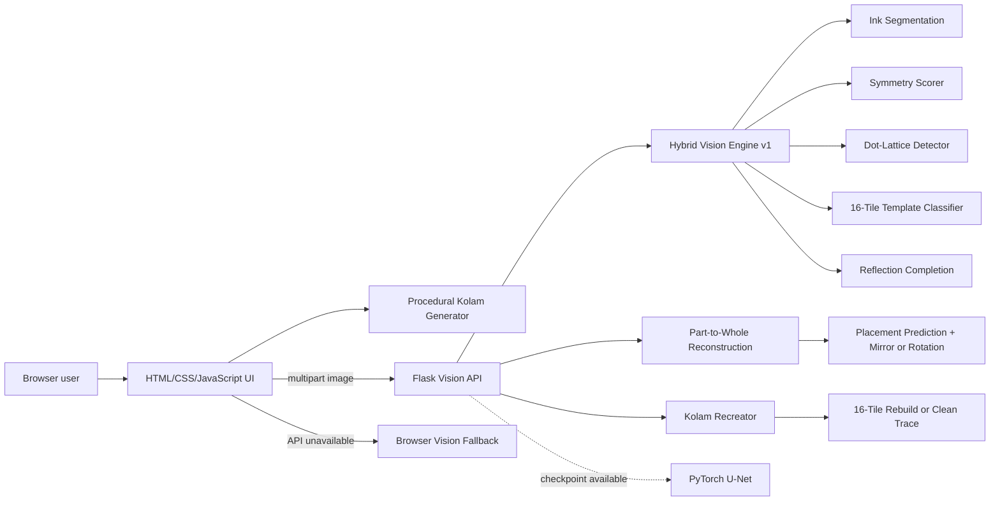

# KOLAMAYA Architecture

## Request flow

### Generation

Generation remains client-side because procedural SVG creation is instant, private, and does not require a model server.

### Analysis

1. The frontend uploads an image to `POST /api/analyze`.
2. The backend estimates the border/background color and creates an ink mask.
3. Fuzzy reflected masks produce vertical, horizontal, and 180-degree symmetry scores.
4. Local-density peaks and autocorrelation estimate the dot lattice.
5. Grid cells are compared with 16 normalized geometric curve templates.
6. The API returns metrics and detected coordinates as JSON.
7. The frontend draws the annotated grid without uploading data elsewhere.

### Completion

1. The frontend sends the partial image, symmetry mode, and selected engine.
2. The default hybrid engine detects which half contains ink and performs a deterministic reflection.
3. If a trained U-Net checkpoint is present and selected, the neural service predicts the complete binary stroke mask.
4. The API returns a PNG with model and mode headers.

## Reliability strategy

- The hybrid engine is always available after core dependencies are installed.
- The frontend has a browser-side fallback if Flask is unreachable.
- U-Net is enabled only when a valid checkpoint loads.
- `/api/model/info` exposes exactly which model is active.
- No user image is persisted by the backend.

## Main boundaries

- `frontend/`: presentation, browser generation, animation, and export.
- `backend/routes/`: HTTP validation and response formatting.
- `backend/services/`: deterministic vision and model-serving logic.
- `backend/models/`: neural architecture and geometric template data.
- `backend/training/`: reproducible synthetic-data and training pipeline.
